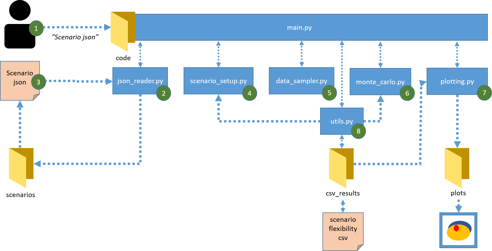
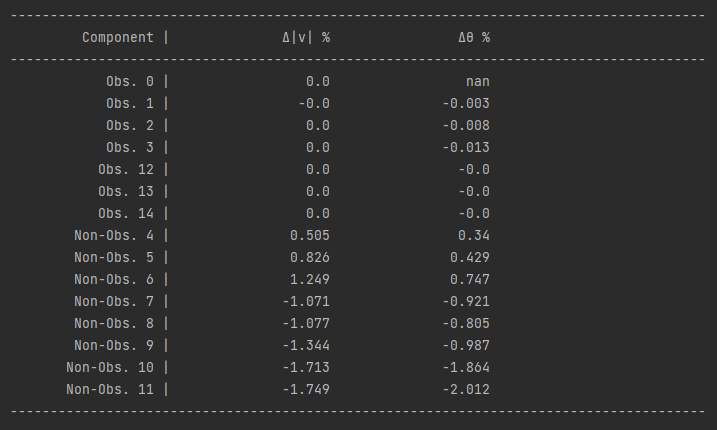
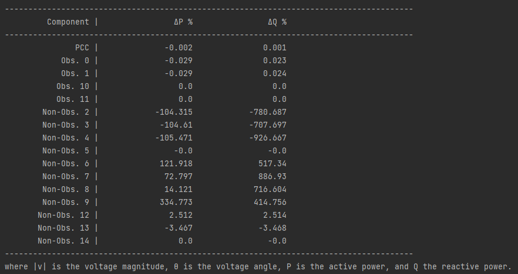
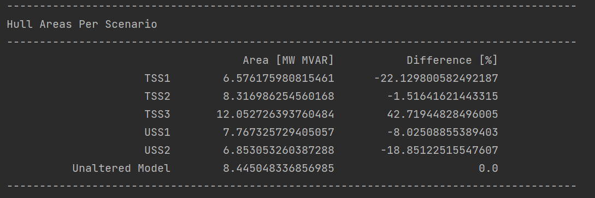
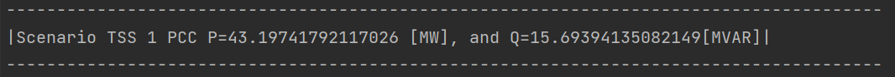

# Study Case Flexibility with Low Observability
This code runs power flow-based simulations on the PandaPower CIGRE MV with PV and WT DER for flexibility estimation.

## Citation:
If you use this code, please cite our corresponding paper "Exploring Operational Flexibility of Active
Distribution Networks with Low Observability" whose study case is implemented either by:
- Through the scholar url: TBD
- Through the doi: TBD
- Using the cite option at the right of your screen

## Algorithm:
The algorithm structure is:

## Folders:
- scenarios: json fies which are used to initialize the simulation settings and expected outputs.
- plots: figures generated using the settings specified in scenarios
- csv_results: results generated from the power flow-based simulations if specified in the scenario
- code: python files reading the json file, performing the specified simulations and reporting the specified results

## Code:
- main: the main python file which should run to perform the scenario specified in the json file
- data_sampler: python file used to sample flexibility shifts
- json reader: python file parsing through the json file, testing if the information should be sufficient and 
saving the information
- monte_carlo: python file performing the power flow-based simulations
- plotting: python file plotting the results or requested outputs
- scenario_setup: python file setting up the scenario using the information of the json reader
- utils: functions useful to other python files

## Scenarios:
- USS1: Json file performing the power flow based simulations for the USS1
- USS2: Json file performing the power flow based simulations for the USS2
- TSS1: Json file performing the power flow based simulations for the TSS1
- TSS2: Json file performing the power flow based simulations for the TSS2
- TSS2: Json file performing the power flow based simulations for the TSS3
- Unaltered: Json file performing the power flow based simulations for the unaltered network
- Plot_Convex_Hull_Combination: Json file plotting the areas and their convex hulls from the results of the 
previous json files saved in the csv_results folder

## Publication study case table information:

### Table I
Each time a scenario is run, a comparison between the unaltered and altered model is printed in the output, e.g. for USS2:

By running all scenario json files the information for Table I is obtained.

### Table II
To replicate Table II:
Run the main.py using the "Plot_Convex_Hulls" json file. Using this json file, the algorithm reads all csv_files specified, computes their convex hulls, 
prints the Table II on the output window, and plots the convex hulls. The printed table is:

To generate the csv files, run the main.py file 6 times, with inputs each of the json files:
    - TSS1, TSS2, TSS3, USS1, USS2, and Unaltered_Net 

## Plots
To generate Fig. 4 run the main.py file with Plot_Convex_Hulls as the input json file. 
This, will generate all flexibility areas in individual figures.
Running the Plot_Convex_Hull_Combined would create a single figure with all scenario flexibility areas

## Run Scenario
To run scenarios and execute the code:
1. Open the terminal from the Study_Case_Flex_Low_Observability directory
2. Type: python code/main.py {scenario_name}, where {scenario name} is the name of the json file to be parsed

## Create Scenario
To create a new scenario, a json file needs to be created with entries:
- name: a string which will be used in all output files
- scenario settings: a dictionary with all scenario information, including:

  - network: the PandaPower network used (currently only CIGRE MV with DER PV and WT is supported)  
  - no_samples: number of samples for the power flow-based simulation iterations, integer
  - distribution: distribution for the sample generation, currently supported: 
    - 'Normal_Limits_Oriented', 'Normal', and 'Uniform'
  - keep_mp: boolean whether DG power output can be reduced or only their power factor can be shifted
  - max_curr_per: maximum loading percentage allowed, float or int, e.g.100 
  - max_volt_pu: maximum per unit voltage allowed, float, e.g.1.05
  - min_volt_pu: minimum per unit voltage allowed, float, e.g.0.95
  - Monte_Carlo_simulation: boolean whether power flow-based simulations will be run, 
  or only the existing csv files will be used,
  - FSPs: Which types of FSPs will be used, options:
    - "All" (for both DG and Loads)
    - 'DG only' (for only DG FSPs)
    - 'Load only' (for only Load FSPs)
  - FSP_WT_indices: list of indices of flexible wind turbines, e.g [1,3,4]
    - If the list has a single element of -1, then all wind turbines are assumed FSPs
  - FSP_PV_indices: list of indices of flexible solar photovoltaics, e.g [1,3,4]
    - If the list has a single element of -1, then all solar photovoltaics are assumed FSPs
  - FSP_Load_indices: list of indices of flexible loads, e.g [1,3,4]
    - If the list has a single element of -1, then all loads are assumed FSPs
  - observable_lines_indices: list of indices of observable lines, e.g [1,3,4]
    - If the list has a single element of -1, then all lines are assumed observable
  - observable_buses_indices: list of indices of observable buses, e.g [1,3,4]
    - If the list has a single element of -1, then all buses are assumed observable
  - scenario_type: a dictionary for the network altering scenario to be used. Options:
    - name: string. Options are: "TSS","USS","Unaltered Model"
    - no.: integer. Scenario number, as shown in the publication, 
i.e. for USS 1, or 2, for TSS 1, 2, or 3
  - plot_settings: a dictionary with settings for the plot generation
    - convex_hull: boolean. If true, plots with convex hull areas will be created, 
and the Table II equivalent on the specified filenames will be returned on the output window. 
If false, plots will not include convex hull and Table II information will not be printed.
    - plot_combination: boolean. If true, a single figure will be created with all filenames' areas.
If false, a figure will be created for each filename
    - multiplicity: boolean. Whether multiplicity should be plotted for each input filename (for power flow-based approaches, these plots are not sufficient as they are highly dependent on the sampling distribution)
    - filenames : list of strings with the csv filenames to be used for plots and output generation. These filenames should exist under the csv_results directory.
    - legends: list of strings with the titles for each of the filenames above
    - operating_points: list of the initial PQ values of each of the filenames. These values can be obtained by running each of the json files of these scenarios and saving the PCC PQ printed on the output window, e.g. 
    - output type: string of the type of figures saved, e.g."png", "jpg", "svg" 
    

    
## License
Shield: [![CC BY 4.0][cc-by-shield]][cc-by]

This work is licensed under a
[Creative Commons Attribution 4.0 International License][cc-by].

[![CC BY 4.0][cc-by-image]][cc-by]

[cc-by]: http://creativecommons.org/licenses/by/4.0/
[cc-by-image]: https://i.creativecommons.org/l/by/4.0/88x31.png
[cc-by-shield]: https://img.shields.io/badge/License-CC%20BY%204.0-lightgrey.svg
    
